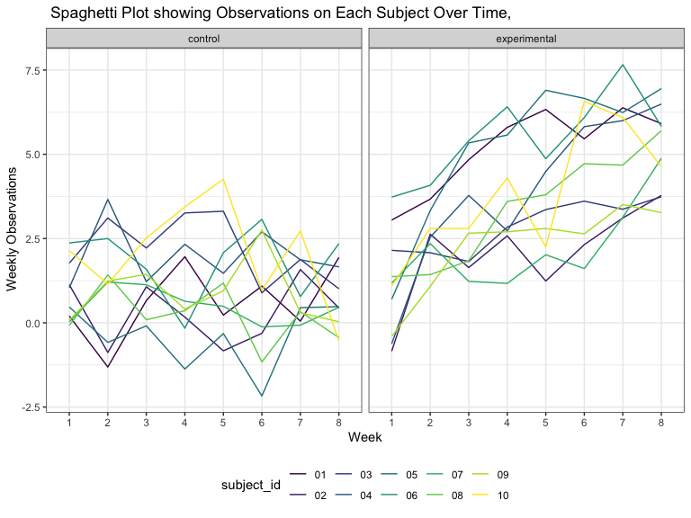

hw5
================
Keyi Wang
11/6/2019

## problem 1

``` r
set.seed(10)

iris_with_missing = iris %>% 
  map_df(~replace(.x, sample(1:150, 20), NA)) %>%
  mutate(Species = as.character(Species))

## writing function filling
  filling = function(vector) {
  if (!is.vector(vector)) {
    stop("Input should be a vector.")
  }
  if (is.numeric(vector)) {
    vector = vector %>% 
      replace_na(mean(vector[!is.na(vector)]))
  }  else if(is.character(vector)) {
    vector = vector %>% replace_na ("virginica")
  } 
  }
  iris_without_missing = map_df(.x = iris_with_missing, ~ filling(.x))
  iris_without_missing
```

    ## # A tibble: 150 x 5
    ##    Sepal.Length Sepal.Width Petal.Length Petal.Width Species
    ##           <dbl>       <dbl>        <dbl>       <dbl> <chr>  
    ##  1         5.1          3.5         1.4         0.2  setosa 
    ##  2         4.9          3           1.4         0.2  setosa 
    ##  3         4.7          3.2         1.3         0.2  setosa 
    ##  4         4.6          3.1         1.5         1.19 setosa 
    ##  5         5            3.6         1.4         0.2  setosa 
    ##  6         5.4          3.9         1.7         0.4  setosa 
    ##  7         5.82         3.4         1.4         0.3  setosa 
    ##  8         5            3.4         1.5         0.2  setosa 
    ##  9         4.4          2.9         1.4         0.2  setosa 
    ## 10         4.9          3.1         3.77        0.1  setosa 
    ## # … with 140 more rows

## problem 2

``` r
## dataframe of all the datasets
total_dataset = list.files(path = "./data/", full.names = TRUE) %>% 
  as.data.frame() %>% 
  rename("file_id" = ".") %>% 
  mutate(file_id = as.character(file_id))

##Create a tidy dataframe containing data from all participants, including the subject ID, arm, and observations over time  
 tidy_data =  
 total_dataset %>% 
  mutate("data" = purrr::map(.x = pull(., file_id), read_csv),
         file_id = str_extract(file_id, "[conexp]{3}_[0-9]{2}")) %>%
  unnest() %>% 
    pivot_longer(
    names_prefix = "week_",
    cols = week_1:week_8,
    names_to = "week",
    values_to = "observations"
  ) %>%   
  separate(file_id, into = c("arm", "subject_id"), sep = "_") %>% 
  mutate(arm = recode(arm , "con" = "control", "exp" = "experimental"),
         subject_id = as.factor(subject_id),
         arm = as.factor(arm)) %>% 
  select(subject_id, arm, everything())

## Make a spaghetti plot showing observations on each subject over time, and comment on differences between groups.

tidy_data %>% 
  ggplot(aes(x = week, y = observations, group = subject_id)) +
  geom_line(aes(color = subject_id)) +
  facet_grid( . ~ arm) +
  labs(
    title = " Spaghetti Plot showing Observations on Each Subject Over Time,  ",
    x = "Week",
    y = " Weekly Observations"
  )
```


Interpretation: Based on the plot above, we can see that on average that
as time went by, the weekly observation is relative stable in control
group. On the contrary, there was a increasing trend in weekly
observation in experimental group. Overall, experimental group showed
larger observation than control group.

## problem 3

``` r
# function for doing regression simulation and set parameters mentioned
sim_regression = function(n = 30, beta0 = 2, beta1 = 0) {
    sim_data = tibble(
    x = rnorm(n, mean = 1, sd = 1),
    y = beta0 + beta1 * x + rnorm(n, mean = 0, sd = sqrt(50))
  )
  
  ls_fit = lm(y ~ x, data = sim_data)
  
  ls_with_pvalue = broom::tidy(ls_fit)
  
  # create a dataframe with two variables: beta1_hat and its p-values
  tibble(
    beta1_hat = ls_with_pvalue[[2, "estimate"]],
    p_value = ls_with_pvalue[[2, "p.value"]]
  )
}
```
